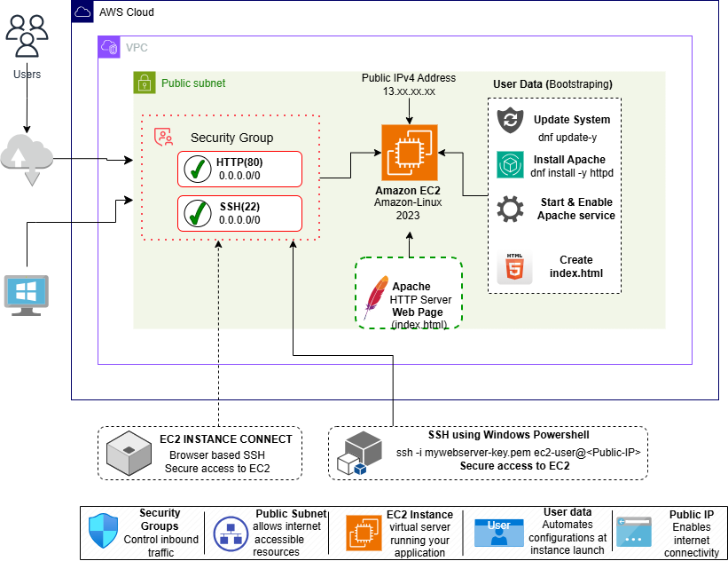
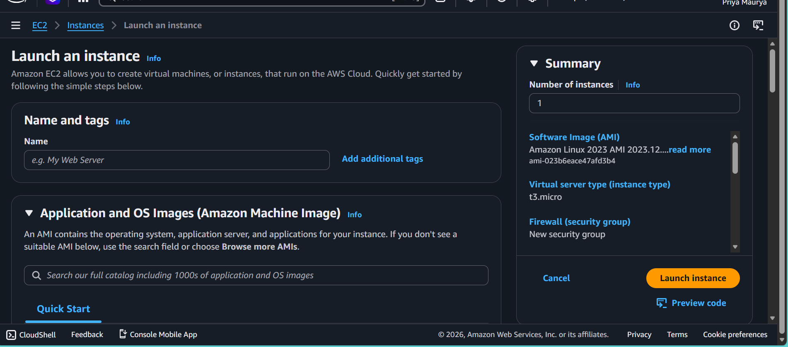
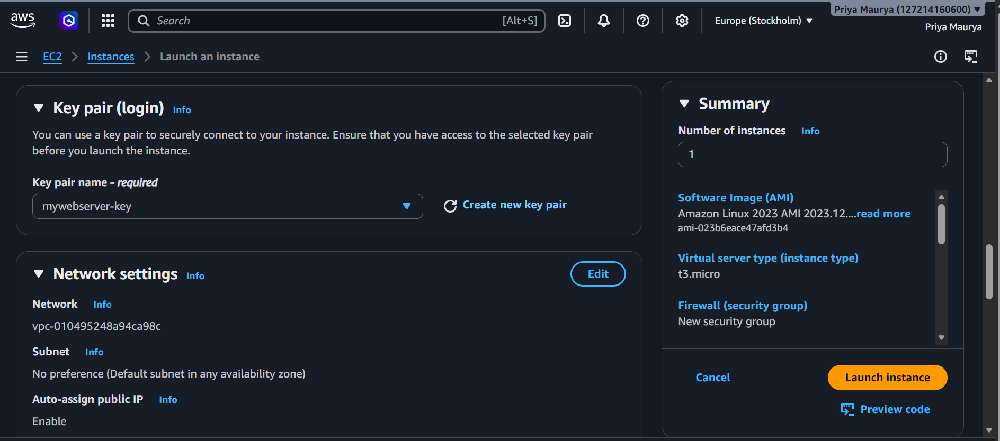
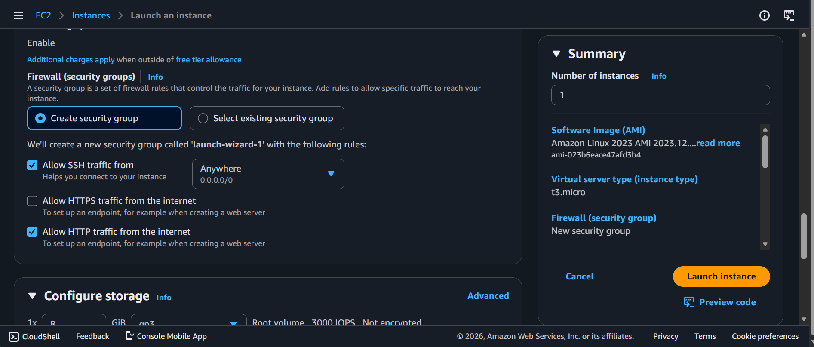
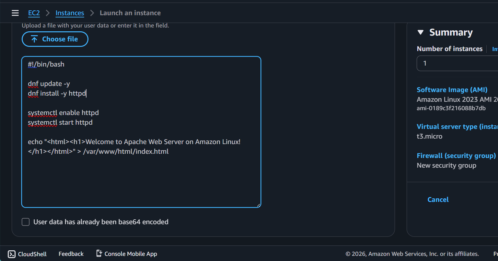
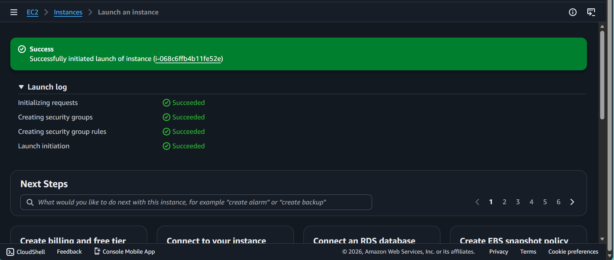
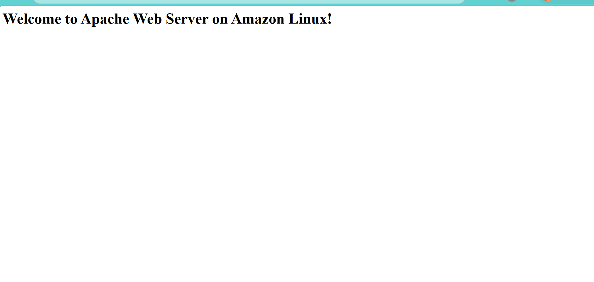
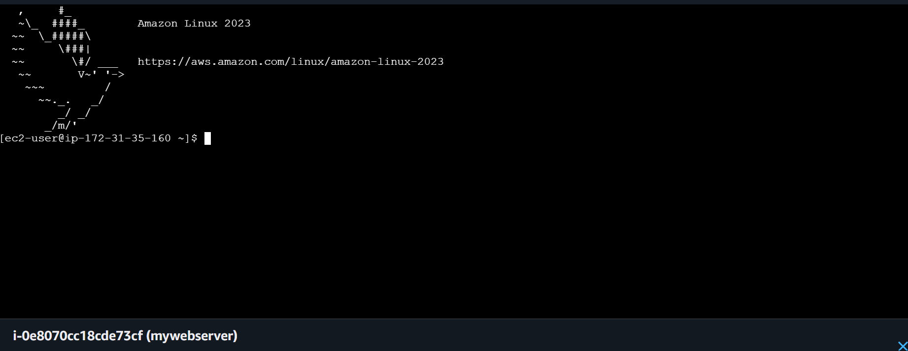
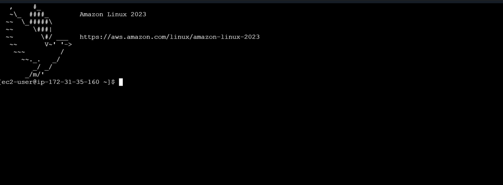

# AWS EC2 Web Server Deployment

## Project Overview

This project demonstrates the practical deployment of an Apache Web Server on Amazon EC2. It covers launching an EC2 instance, creating an SSH key pair, configuring Security Groups, automating server configuration using User Data, connecting to the instance using EC2 Instance Connect and Windows PowerShell (SSH), and understanding how Security Groups control inbound traffic.

This project provides hands-on experience with core AWS EC2 concepts and follows cloud security best practices.

---

# Project Objectives

- Launch an Amazon EC2 Instance
- Create an SSH Key Pair
- Configure Security Groups
- Deploy Apache Web Server using User Data
- Verify Instance Health
- Access the Web Server through a Public IP
- Connect using EC2 Instance Connect
- Connect using Windows PowerShell (SSH)
- Understand Security Group behavior by modifying HTTP rules

---

# AWS Services Used

- Amazon EC2
- Amazon VPC
- Security Groups
- EC2 Instance Connect
- AWS Identity and Access Management (IAM)

---

# Architecture Diagram



---

# Project Implementation

## Step 1: Launch EC2 Instance

Launched an Amazon EC2 instance using:

- Amazon Linux 2023 AMI
- t3.micro Instance
- Default VPC
- Public Subnet
- Auto-assigned Public IPv4 Address

Screenshot:



---

## Step 2: Create an SSH Key Pair

Created a new SSH Key Pair for secure remote access.

Key Pair Name:

- mywebserver-key

Screenshot:



---

## Step 3: Configure Security Group

Configured inbound rules to allow:

- SSH (Port 22)
- HTTP (Port 80)

These rules allow secure administration and public access to the hosted web server.

Screenshot:



---

## Step 4: Configure User Data

Configured EC2 User Data to automatically install and start the Apache HTTP Server during instance launch.

User Data Script:

```bash
#!/bin/bash

sudo yum update -y

sudo yum install -y httpd

sudo systemctl start httpd

sudo systemctl enable httpd

echo "<html><h1>Welcome to Apache Web Server on Amazon Linux!</h1></html>" > /var/www/html/index.html
```

Screenshot:



---

## Step 5: Verify Instance Running

Verified that the EC2 instance entered the **Running** state and was assigned a Public IPv4 Address.

Screenshot:



---

## Step 6: Verify Status Checks

Confirmed that both EC2 health checks passed successfully.

- System Status Check
- Instance Status Check

This indicates that the instance is healthy and fully operational.


---

## Step 7: Verify Web Server

Accessed the EC2 Public IPv4 Address through a web browser.

The Apache Web Server page created by the User Data script loaded successfully.

Screenshot:



---

## Step 8: Connect Using EC2 Instance Connect

Connected to the EC2 instance directly from the AWS Management Console using **EC2 Instance Connect**.

Verified successful terminal access to the Amazon Linux 2023 instance.

Screenshot:



---

## Step 9: Connect Using Windows PowerShell (SSH)

Connected securely to the EC2 instance using Windows PowerShell.

Example command:

```bash
ssh -i mywebserver-key.pem ec2-user@<Public-IP>
```

Successfully verified remote SSH access to the instance.

Screenshot:



---

## Step 10: Security Group Experiment

To understand how Security Groups control network traffic, the HTTP (Port 80) inbound rule was temporarily removed.

Result:

- Website became inaccessible.
- Browser returned a connection error because HTTP traffic was blocked.

After re-adding the HTTP rule, the website became accessible again.

This experiment demonstrates how Security Groups function as stateful virtual firewalls controlling inbound traffic.


---

# Security Best Practices Followed

- Used SSH Key Pair authentication instead of passwords.
- Configured Security Groups to restrict inbound traffic.
- Automated server configuration using User Data.
- Verified instance health using EC2 Status Checks.
- Used EC2 Instance Connect for browser-based administration.
- Connected securely using Windows PowerShell (SSH).
- Followed the Principle of Least Privilege.

---

# Skills Demonstrated

- Amazon EC2
- Amazon Linux 2023
- EC2 Launch Process
- Security Groups
- EC2 Instance Connect
- SSH
- User Data
- Apache HTTP Server
- Linux Administration
- Cloud Networking
- Infrastructure Deployment
- AWS Fundamentals

---

# Learning Outcomes

Through this project, I gained practical experience launching and managing an Amazon EC2 instance. I learned how to automate server provisioning using User Data, configure Security Groups, securely access an instance through EC2 Instance Connect and SSH, deploy an Apache web server, and understand how firewall rules affect application accessibility.

---

# Author

**Priya Maurya**

B.Tech Computer Science Engineering

Aspiring Cloud Security Engineer

GitHub: https://github.com/Priya-dev-hub
